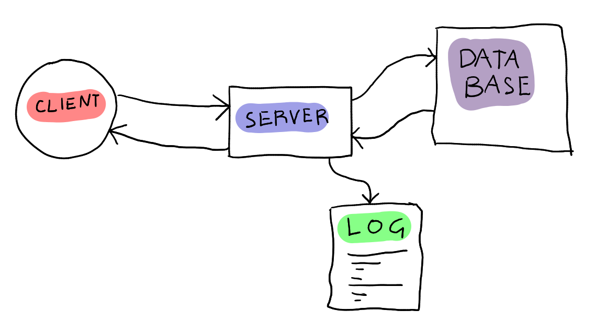

# INF226 Mandatory Assigment 2B

> Fabio Gaiba

# Documentation

> For this project it's assumed connection over https.

## Design choices

This application is implemented through *flask* and *sqlite*, directly following from the [excercise](https://git.app.uib.no/inf226/22h/login-server).  

The main design choices during the developing of this minimal web application were:

1. Implement just the needed features.
   
   - Generally speaking, the more **complex** is the app the greater is the **attack surface**.
   - Compared to the exercise, I got rid of the announcments and some more minor details

2. Leave as much responsibility as possibles to the libraries.
   
   - As good as a developer can be, relieng on libraries it's not bad at all. The are more secure, more tested, updated more often and probably also faster. 
   - The managing of the session, as well as authentication and authorization is done hand in hand with *flask*

3. Every user input must be checked 

    - A great effort is made to make sure that every user input is treated carefully. 

4. Split code across multiple file (with relative meaning)

    - The code provided in the **exercise** were poorly structered. A good part of this project was just refactoring the code provided. What I tried to do is to split the code across multiple files and wrapping some useful function for reutilization. 
    - The result is not great. Given more time I would have spent more energy into improving the quality of the code, as many security flwas usually come from messy logic. It was pretty difficult working with many unseen (for me) technologies.


## Features

The application is a minimal instant groupchat. It is possible to:

- **create an account**:
    - Username must contain only letters, numbers and "." of "_"
    - Passwords are safely hashed with salt and stored in a database. 
    - Assuming `HTTPS`, nobody (even who runs the server) won't be able to see the password.
- **sending messages**:
    - send private messages to a single user
    - send messages to all users
    - reply to a certain message
- **recive messages**
    - all the the message sent to (or by) the user are **automatically** displayed, without any user input
    - you can also search for a particular message (using the ID), it will displayed as last
    - after doing many searches, you can use `show all` to delet those searches.


## How to test it

### Get it to run

You need `flask` and `apsw` to run the server:

```
pip install flask flask_login flask_wtf
pip install apsw
```

Then it's should be sufficient to execute

```
python -m flask --app app run
```

The server will be running in `localhost:5000`


### The web interface

Upon connection you'll be redirected to the login page. If you are not registered yet you can by clicking on the register link. If something is wrong with your username and/or password (e.x. invalid username) it will be displayed. Some rules:
- usernames can contain any combination of letters (upper or lower case), or `.` and `_`
    - `___` or `...` are valid username, but any other character is forbidden
- password must contain at leas one uppercase letter, on lowercase and a number. It should be at least 8 character
 

Once logged in you'll be redirected on the main page, where all messages sent by or to you will be **automatically** displayed. Here you can:
- write a message and send it with the send button
    - in the retriever field you have to put a username or the string `#all` if you want to send the message to everybody
    - in the reply field you may insert the ID of the message you are replying to.
- given a message ID, you can retrieve the message
    - it will be shown as a new message in the chat. If you want to get rid of the searches press `Show all` and the searches will be cleared.
- you can logout by clicking on the logout link.


## Implementation

### File division

The structure of the [excercise](https://git.app.uib.no/inf226/22h/login-server) was pretty *messy*, deviding the code across multiple file with purpouse in mind helps a lot. The easier the cose is to understand, the easier it is to spot problems and security flaws. I tried to refactor, deviding like this:

- `app.py`
    - import all the other scripts, inizialize the database if none is found
- `globalss.py`
    - inizialize the global objects used across all the files
- `login_form.py`
    - the form used to do both login and registration
- `loginAPI.py`
    - here are implemented all the routes for logging in and registrate
- `messageAPI.py`
    - here are implented all the routes for sending and recieving messages
- `utils.py`
    - implement some utility function used by the API
    - dealing with executing database queries

### APIs

I implented the requierd APIs. Althoug, given that the messaging had to be instant, I found little use of the `/messages` route. I also implemented another route `/messages/myids` that returns a list of the IDs of the messages returned by `/messages`. 
- The client make a request every second for `/messages/myids`. If it founds some IDs that are not displayed, it requests just that specifics messages and display them. I found this way not only easier, but also way better for performance (less traffic and load for the client)

Also for the login and registration there are `/login` and `/register` and `/logout`
- session management is left to flask.


# Questions

## Threat model 

> Who might attack the application? What can an attacker do? What damage could be done (in terms of confidentiality, integrity, availability)? Are there limits to what an attacker can do? Are there limits to what we can sensibly protect against?

> In order to produce the Threat model, I stricly followd the [Cheat Sheet](https://cheatsheetseries.owasp.org/cheatsheets/Threat_Modeling_Cheat_Sheet.html).

### Modeling of the system

#### Data flow

First of all, it's important to understand the system. Here a flow diagram:



The data flows accordingly to the diagram. A client makes requests to the server, to server recieve those requests, elaborate them, interact with the database (storing or fetching data depending on the request) and then the server replies to the client, supplying it with data.

#### Trust boundaries

I identified 2 trust boundaries.
1. The more obvious one is between the **client** and the **server**. We trust that:
    - the **client** has authorization to make those request
    - the data supplyied by the **client** is valid and not dangerous
    - the **server** is sending the requested data (no integrity breach)
    - such data will not produce unexpected results to the **client**
1. One it's from the **server** to the  **database**. The system trust that the data is not dangerous, so to speak the quearies will not produce unexpected results.

#### System entry points

Potential attackers can interact with the system in mostly two ways.

1. whith the login and registration form
    - They could try to break the authentication system, hence getting unintended authorization
2. Once logged in, sending or retrieving 
    - they could try to attack through the payload of a message, the username, the Id, the query of a search, etc.


### Identify threat agents

#### Users

To determine the *impact* and the *likelyhood* of threats it's important to define the target audience.
The project is extremely minimal. In developing it, I imagend it will be used as self hosted messaging server between friends. We can also think that a company will use it as the working groupchat (in that case the *impact* may rise, but it really depends on the group of people using it).

#### Threat agents

A threat agent could be anybody intersted in compromising the working of the groupchat application. If it's a group of friend it can simply be a thief of personal information. If It's a company using the system It may be somebody trying to steal buisness information or compromising the workflow of such company. 

#### Possible Damage

The threat agent may be doing mainly two thing:
- breaching *confidentiality*, i.e. getting access to messages he is not supposed to see.
- breaching *integrity*, i.e. changing the content of a message, delete messages, etc.

It's also possible that the agent wants to compromise *availability* of the system:
- overwhelm the server with requests
- overwhelm the database with data
- cause an error that stop the server

#### Limits to the attacker

The attacker can interact with the server just with the requests. Provided that the security mesaurs taken are sufficient, he cannot:
- inspect the database without sufficient authorization
- gain authorization he is not supposed to have
- injecting dangerous data into the system

#### Limits on what we can Protect

Given the target audience of this application, there are no limits the amount of data sent to database, the amount of request the serve accepts. *Availability* can be easily compromised. Given more time I would have implemented more controls, especially on the amount of data the server is ok recieving


## What are the main attack vectors for the application?

The main [attack vectors](https://www.upguard.com/blog/attack-vector) taken in cosidaration for this application are:

- Database query injection (*SQL injections*)
    - I used prepared statments, so the queries are not done simply concatenating strings
- Cross Site Sripting
    - When the server recieve messages, the content is filtered and dangerous character are substituted. It's therefore safe sending back retrieved content from the database.
- Cross Site request forgery (Session Hijacking)
    - `flask_login` provide a `csrf_token` to protect against those attacks (and handles all the authorization part)
- Inseccure redirection:
    - The redirection links are checked to be on the same network as the server
- Server Side request forgery
    - possible `routes` are defined, so the user cannot access unintended resources
- Compromised Credentials
    - passwords are stored hashed and salted, so even if the database it's compromised credentials cannot be stolen
- Weak Credential
    - during registration, the user is required to provide strong enough passwords. That lower gratly the possibility of password guessing.

Also some other general extra touches:

- username are whitelisted, therefore can be trusted.
- for random number generation (useful for `flask.secret` and generating `salt` for hashes) `os.urandom` it's used, and it's considered very secure
- for hashing, a wrapper of SHA3 256 it's used, which is considere highly secure


## What is the access control model?

In this system, the **access control model** it's straightforward. A user can 
- send messages to anyone
    - no user blocking system was implemented
- retrieve messagese where the user it's either the sender or the recipients
    - when performing the retrieveng query, the `sender` and `recipients` field are controlled accordingly

## How can you know that you security is good enough? (traceability)

In order to discover possible security breaches, a logging system it's implemented. The file it's called `mordor.log`, and it stores:
- logged in/out users
- all the `http` requests
- the results of the queries that are done.

In this way, we have a very good understanding on the 


